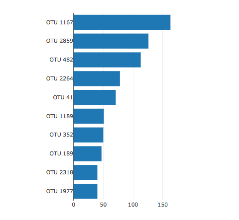
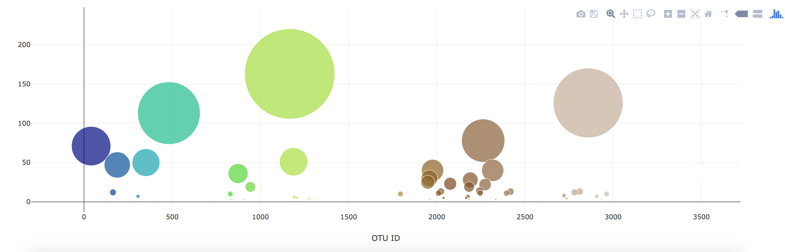
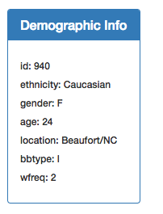
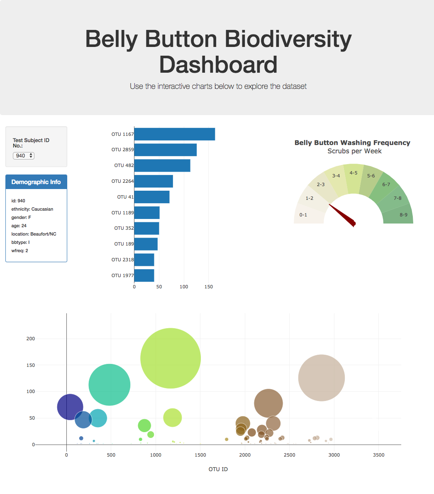

# Belly-Button-Challenge

## Background 
In this assignment, we were provided with a sample file that held our dataset that we used to create our visualizations. We were tasked with creating a bar chart, bubble chart, and a metadata chart that each change when we select a new person/object. Below are the instructions used to create our charts, and a link to Github pages. 

## Instructions: 

1. Use the D3 library to read in samples.json from the URL https://2u-data-curriculum-team.s3.amazonaws.com/dataviz-classroom/v1.1/14-Interactive-Web-Visualizations/02-Homework/samples.json.

2. Create a horizontal bar chart with a dropdown menu to display the top 10 OTUs found in that individual.

- Use sample_values as the values for the bar chart.

- Use otu_ids as the labels for the bar chart.

- Use otu_labels as the hovertext for the chart.

3. Create a bubble chart that displays each sample.

- Use otu_ids for the x values.

- Use sample_values for the y values.

- Use sample_values for the marker size.

- Use otu_ids for the marker colors.

- Use otu_labels for the text values.

4. Display the sample metadata, i.e., an individual's demographic information.

5. Display each key-value pair from the metadata JSON object somewhere on the page.

6. Update all the plots when a new sample is selected. Additionally, you are welcome to create any layout that you would like for your dashboard. An example dashboard is shown as follows:

7. Deploy your app to a free static page hosting service, such as GitHub Pages. Submit the links to your deployment and your GitHub repo. Ensure that your repository has regular commits and a thorough README.md file

All code was created by following examples from UO Data Analytics Bootcamp, and utilizing activities done while in class. 

Github Pages Link: https://stoddow313.github.io/Belly-Button-Challenge/
